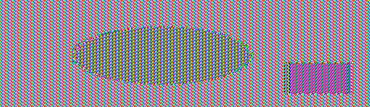

# Lab 2 - Playing with Symmetric Encryption

### Team Members:
1. Adam Robertson, abr5598@psu.edu, 938152440

## Drills
There are four tasks for you to complete. Please give a brief summary of what you did – feel free to include any thoughts / concerns / problems / etc. you encountered during the tasks. Also, include your answers to the questions asked in each task. Save your report as a PDF and submit it to Canvas before the deadline.


## Task 1

### Task 1: Summary

In this task we encrypted a plaintext using different encryption methods and modes.

1. Blowfish
2. DES
3. DES3
4. ARC4

### Task 1: Question Answers

> No Submission


## Task 2

### Task 2: Summary

In this task, we encrypted a .bmp image with ECB and CBC modes with AES-128. We can see how in ECB, patterns can still emerge from the encrypted image.

### Task 2: Question Answers

> 1. Include both **the original picture** and **two encrypted pictures** in your report.
> 
> 
> 
> 
> 
> 2. Include the python script in the report.
> 
> ``` python
> import os
> from Crypto.Cipher import AES
> 
> inImage = open("original.bmp", "rb").read()
> header = inImage[:54]
> image = inImage[54:]
> ecbOutImage = bytearray(header)
> cbcOutImage = bytearray(header)
> 
> 
> key = b'itsmysecretimage'
> 
> ecbEncryptor = AES.new(key, AES.MODE_ECB)
> cbcEncryptor = AES.new(key, AES.MODE_CBC)
> for chunkNum in range(0, len(image), 16):
>     bytesLeft = len(image) - chunkNum
>     
>     
>     if bytesLeft < 16: 
>         if bytesLeft != 0:
>             chunk = image[chunkNum:] + (b' ' * (16 - bytesLeft))
>         else:
>             break
>     else:    
>         chunk = image[chunkNum:chunkNum + 16]
>     
>     ecbOutImage += ecbEncryptor.encrypt(chunk)
>     cbcOutImage += cbcEncryptor.encrypt(chunk)
> 
> output = open('ecb_encrypted_image.bmp', "wb")
> output.write(ecbOutImage)
> output.close()
> 
> output = open('cbc_encrypted_image.bmp', "wb")
> output.write(cbcOutImage)
> output.close()
> ```


## Task 3

### Task 3: Summary

In task 3, we test how much information is recoverable from a corrupted file in both ECB and CBC modes.


### Task 3: Question Answers

> 1. How much information can you recover by decrypting the corrupted file, if the encryption mode is ECB, CBC respectively?
> 
> The string encrypted in CBC mode had less information that could be recovered. Whether it is significantly less or slightly less is up to chance.
> 
> 2. Please explain why.
> 
> In ECB mode, a corrupted bit will only corrupt the block it is in. However, in CBC mode, a corrupted bit has the chance of corrupting all the blocks after it. This is because during encryption, the previous block is used to encrypt the next block.


## Task 4

### Task 4: Summary

In task 4, we are asked to find the key used to encrypt a plaintext.
We can do this because we are given the plaintext, the cipher text, a dictionary of potential keys, the IV, and rules on how the key and plaintext are padded. 

### Task 4: Question Answers

> 1. What is the encryption key?
>
> The encyprtion key is "hack" with 12 spaces after it.
> 
> 2. Include the python script in the report.
> 
> ``` python
>import os
>from Crypto.Cipher import AES
>import binascii
>
>dictFile = open("words.txt", "r")
>dictionary = dictFile.read().splitlines()
>
>plaintext = b"This is a top secret."
>ciphertext = b"3f814d00c3f1047f1dfa879115970472472a17eabdd9ba4fcd667743e1e03674"
>
>def pad(m):
>    return bytes(m)+bytes([16-len(m)%16])*(16-len(m)%16)
>
>
>dictIndex = 0
>iv = b'\x00' * 16
>paddedPlaintext = pad(plaintext)
>print("Padded plaintext: " + str(paddedPlaintext))
>print("Ciphertext:" + str(ciphertext))
>
>for dictIndex in range(0, len(dictionary)):
>    print()
>    key = bytes(dictionary[dictIndex], 'utf-8') + b'\x20' * (16 - (len(dictionary[dictIndex]) % 16))
>    print("Trying : " + str(dictionary[dictIndex]) + " \tPadded key: " + str(key))
>
>    encoded = AES.new(key, AES.MODE_CBC, iv).encrypt(paddedPlaintext)
>    print("Encoded: " + str(binascii.hexlify(encoded)) + " with key " + str(binascii.hexlify(key)))
>    if str(binascii.hexlify(encoded)) == str(ciphertext):
>        print("Found key! -> " + str(dictionary[dictIndex]))
>        break
>
>
>
> ```

