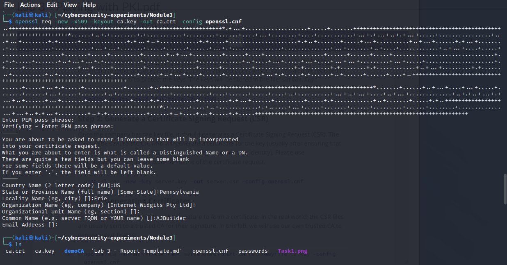
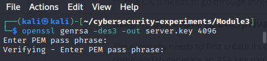
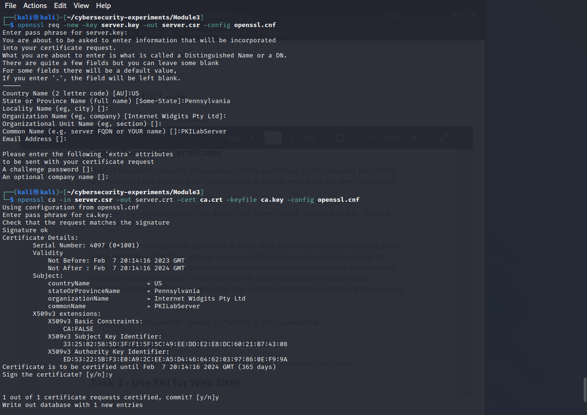
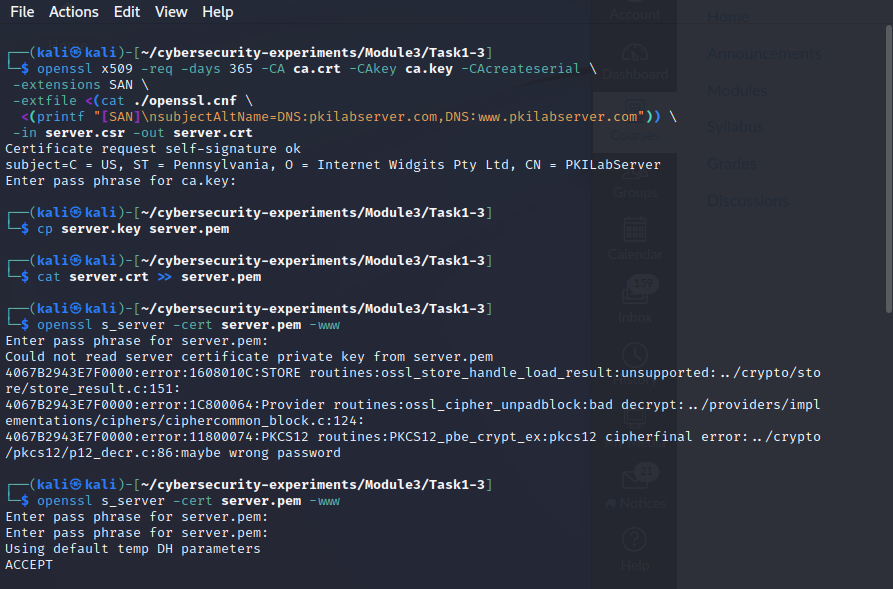
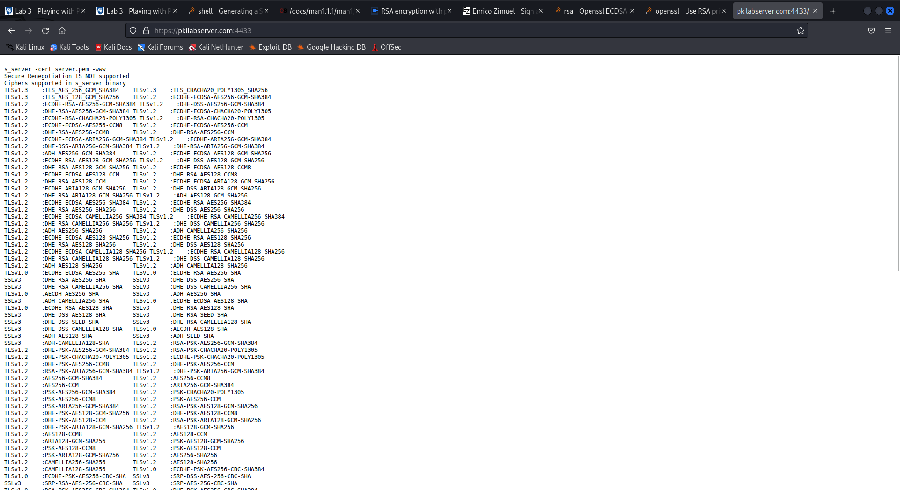
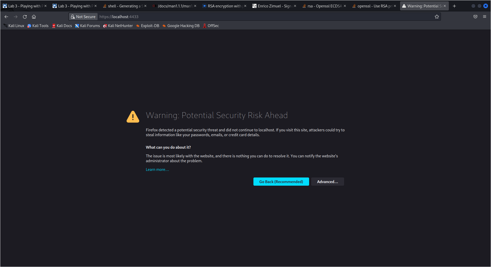
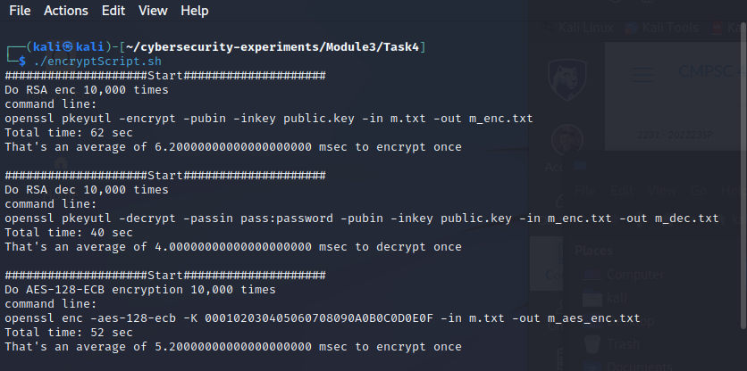
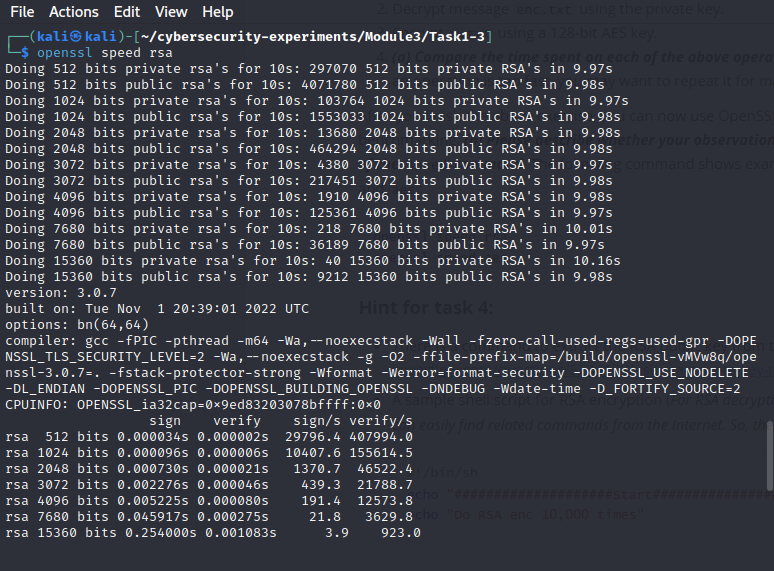
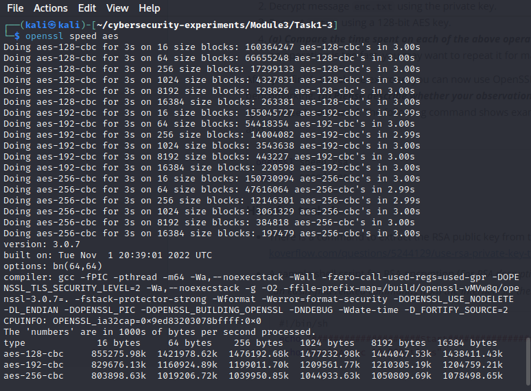
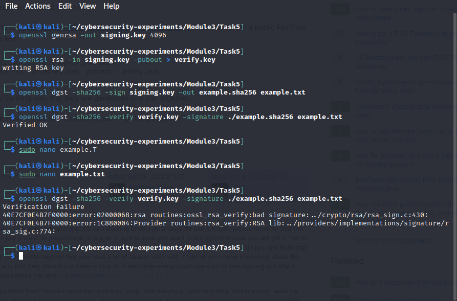

# Lab 3 - Playing with PKI

### Team Members:
1. Adam Robertson, abr5598@psu.edu, 938152440

## Drills
There are five tasks for you to complete. Please give a brief summary of what you did – feel free to include any thoughts / concerns / problems / etc. you encountered during the tasks. Also, include your answers to the questions asked in each task. Save your report as a PDF and submit it to Canvas before the deadline.

## Task 1

### Task 1: Summary

In task 1, we are becoming a Certificate Authority by generating our own root certificate.

### Task 1: Question Answers

> 1. Include the screenshot of your operations, such as commands and output.

## Task 2

### Task 2: Summary

In task 2, we play the part of both the CA and a customer wanting to get a certificate signed by the CA.
The customer generates a certificate signing request using their information and key.
The CA then signs that certificate that the customer can then use for their server.

### Task 2: Question Answers

> 1. Include the screenshot of your operations, such as commands and output.

## Task 3

### Task 3: Summary

In Task 3, we load the root certificate generated in task 1 into our web browser. We then try to connect to a web server that has a certificate signed by the root certifiacte we loaded so we can verify their identity. (We are also hosting the web browser.)

### Task 3: Question Answers
> _The screenshot of your operations can be included for better demo._
>
> 
> 
>
> 1. (a) Please describe and explain your observations
>
> The web browser did not trust the certificate provided by pkilabserver.com until we loaded the Certificate Authorities certificate.
>
> To my understanding, since the server's certificate is signed by the CA's private key, the CA certificate we loaded into the web browser was the public key necessary to decrypt the CA signature on the servers signature. However, I don't understand why the servers private key was necesarry to generate the servers certificate in Task 2. The client never gets the servers public key so they wouldn't be able to verify the servers signature anyway.
>
> 2. (b) What do you observe?
>
>   The webserver says it "cannot read the certificate private key". Which confuses me on what the purpose of the server private key is for. Throughout the lab when refering to the server key, it is never mentioned whether the CA only needs the servers public key or private key, just its "key". I'm assuming when issuing a certificate based on a Certificate Signing Request and a "key" (in task 2), the CA is including the servers **public** key (that was derived from the private key by the CA in this example) somehow in the certificate. So that when a client decrypts the server's certificate using the CA's certificate it can use the public key to then verify the server's identity?
> 
> However, I'm having a hard time finding details online so I will ask you in class. :)
>
> Regardless, I have no idea why changing a byte in the private key keeps it from being "read". Wouldn't it just be a different valid private key? Is there a mechanism in RSA where only certain keys in the entire span are valid? Unless this webserver uses the public key, that I'm assuming is in the
> server's certificate, to verify the private key. If it didn't verify, whatever client that connects and verifies the server's certificate using the CA's would be unable to verify the server's identity since it would
> be unable to decrypt the server's private key encrypted signature.
>
> 3. (c) Please do so, describe and explain your observations
> 
> When the domain name is local host, the web browser sees that the certificate provided by the server does not match the domain name. Its like if I gave you an driver's license that didn't have my name on it.

## Task 4

### Task 4: Summary

In task 4, we are comparing speed benchmarks between RSA and AES. We do this by writing a bash script that uses openssl encryption and decryption and using openssl's builtin "speed" tool.

### Task 4: Question Answers
> _The screenshot of your operations can be included for better demo._
> 1. (a) Compare the time spent on each of the above operations, and describe your observations.
> 
>
> It makes sense that decryption is the fastest. RSA is slower at encrypting. Not sure if the longer key length is a contributing factor. More likely the algorithm.
>
> 2. (b) Please describe whether your observations are similar to those from the outputs of the `speed` command.
> 
> 
> For RSA-4096, the "speed" tool recorded 29796 encryptions per second and 407994 decryptions per second per 32 bytes. To compare it to AES later, we need to find the time per 16 bytes. Taking the inverse and dividing by 2, we find that it took 0.0168 ms to encrypt and 0.00245 ms to decrypt 16 bytes. 
>
> For AES-128-ECB, 160364247 16 byte sized blocks can be encrypted in 3 seconds. Thats a speed of 0.0000187 ms per 16 byte block. 
>
> The speed tool reports much faster times than the bash script. This is due to the latencies in calling a command line tool over and over.

## Task 5

### Task 5: Summary

In Task 5, we sign a file to create digital signature with a private key.
Then we verify the file and signature using the corresponding public key.

### Task 5: Question Answers
> _The screenshot of your operations can be included for better demo._
> 
> 1. (a) Please describe how you did the above operations (e.g., what commands do you use, etc.)
> 
> I used the "genrsa" and "rsa" tools to create the private and public keys.
> Then I used the "dgst" or digest tool to create the hash and signature in one command. Only the signature was generated.
> I then verified the file and signature with the "dgst" again.
> 
> 2. (b) Explain your observations.
> 
> After changing the original file, verifying using the old signature did not work.
>
> 3. (c) Please also explain why digital signatures are useful.
>
> Digital signatures are useful because they allow us to verify the integrity of a file. If a file was tampered with, the signature would not match when there is an attempt to verify the file.

