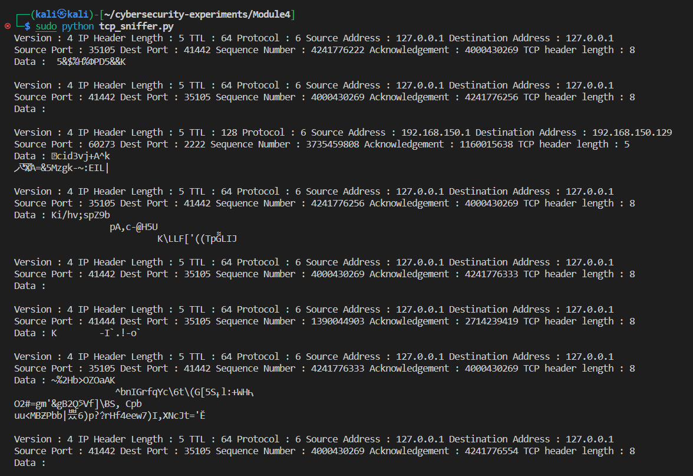
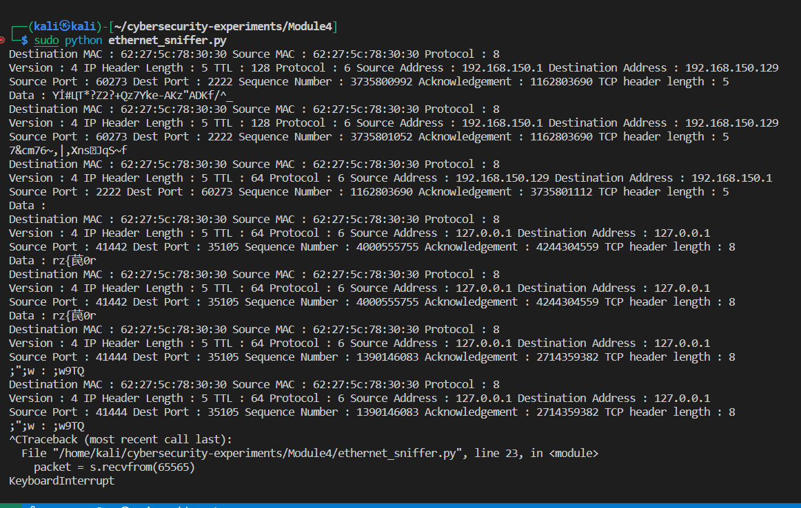
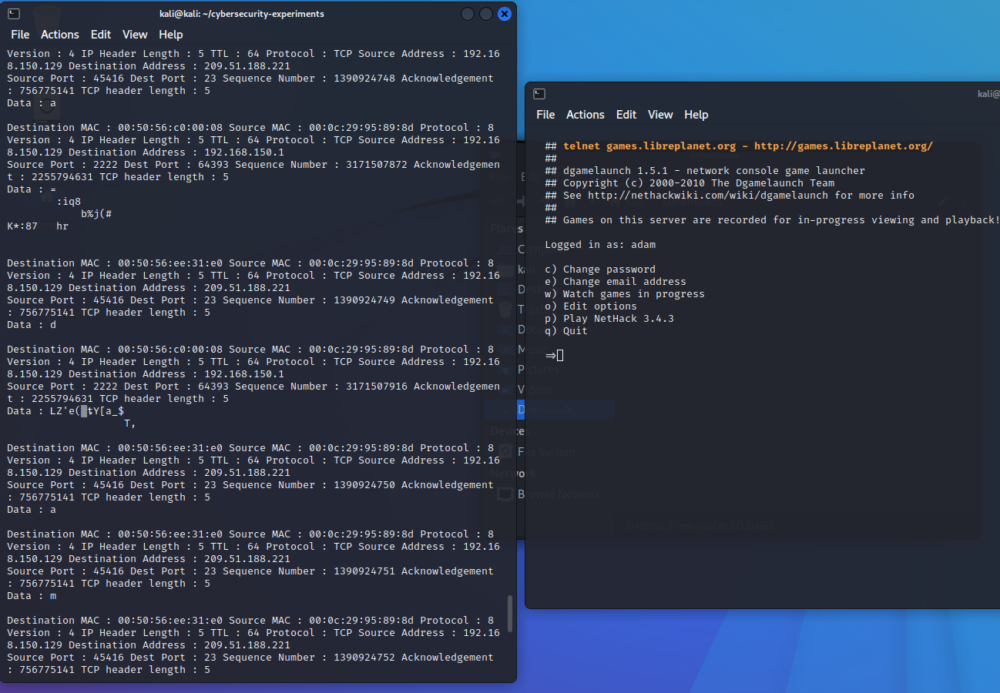
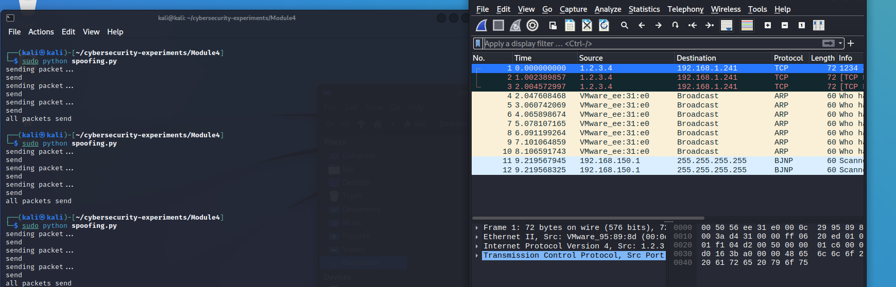

# Lab 4 - Packet Sniffing and Spoofing

### Team Members:
1. Adam Robertson, abr5598@psu.edu, 938152440

## Drills
There are five tasks for you to complete. Please give a brief summary of what you did – feel free to include any thoughts / concerns / problems / etc. you encountered during the tasks. Also, include your answers to the questions asked in each task. Save your report as a PDF and submit it to Canvas before the deadline.


## Task 1

### Task 1: Summary

In this task we looked at coding sample of how to sniff packets by creating a socket on a machine. We also modified one of these samples so it can take an input file with specified filters that are to be applied to the sniffing.

### Task 1: Question Answers

> 1. Include the contents of your `filter.txt`.
>
>  ```
>Protocol: TCP SourceAddress: 192.168.150.129
> ```
> 2. Include your python code.
> ``` python
>import socket, sys
>from struct import *
>
>#Convert a string of 6 characters of ethernet address into a >dash separated hex string
>def eth_addr (a) :
>	b = "%.2x:%.2x:%.2x:%.2x:%.2x:%.2x" % (a[0] , a[1] , a[2], a>[3], a[4] , a[5])
>	return b
>
>#create a AF_PACKET type raw socket (thats basically packet >level)
>#define ETH_P_ALL    0x0003          /* Every packet (be >careful!!!) */
>try:
>	s = socket.socket( socket.AF_PACKET , socket.SOCK_RAW , >socket.ntohs(0x0003))
>except socket.error as msg:
>	print('Socket could not be created. Error Code : ' + str(msg>[0]) + ' Message ' + msg[1])
>	sys.exit()
> 
>prefix = "IPPROTO_"
>protoTable = {num:name[len(prefix):] 
>          for name,num in vars(socket).items()
>            if name.startswith(prefix)}
> 
>filter = open("Module4/filter.txt", 'r').readline()
>filterList = filter.split(" ")
>parameters = {
>    "Protocol" : "",
>    "SourceAddress" : "",
>    "DestinationAddress" : "",
>    "SourcePort" : "",
>    "DestinationPort" : ""
>}
>
>for param in parameters.keys():
>	if (param + ":") in filterList:
>		loc = filterList.index(param + ":")
>		if filterList[loc+1] not in parameters.keys():
>			parameters[param] = filterList[loc+1]
>			filterList.pop(loc+1)
>            
>		filterList.pop(loc)
>
>parameters = {key: v for key, v in parameters.items() if v!=""}
>
>print(parameters)
>
># receive a packet
>while True:
>	packet = s.recvfrom(65565)
>
>	#packet string from tuple
>	packet = packet[0]
> 
>	eth_data = ""
>	net_proto_data = ""
>	phys_data = ""
>
>	#parse ethernet header
>	eth_length = 14
>
>	eth_header = packet[:eth_length]
>	eth = unpack('!6s6sH' , eth_header)
>	eth_protocol = socket.ntohs(eth[2])
>	phys_data = 'Destination MAC : ' + eth_addr(packet[0:6]) + >' Source MAC : ' + eth_addr(packet[6:12]) + ' Protocol : ' >+ str(eth_protocol)
>
>	
> 
>	#Parse IP packets, IP Protocol number = 8
>	if eth_protocol == 8 :
>		#Parse IP header
>		#take first 20 characters for the ip header
>		ip_header = packet[eth_length:20+eth_length]
>		
>		#now unpack them :)
>		iph = unpack('!BBHHHBBH4s4s' , ip_header)
>
>		version_ihl = iph[0]
>		version = version_ihl >> 4
>		ihl = version_ihl & 0xF
>
>		iph_length = ihl * 4
>
>		ttl = iph[5]
>		protocol = iph[6]
>
>		
>  
>		if protoTable[protocol].removeprefix(prefix) != >parameters["Protocol"]:
>			continue
>
>		if protocol == 1:
>			print("hi")
>
>		s_addr = socket.inet_ntoa(iph[8])
>		d_addr = socket.inet_ntoa(iph[9])
>	
>		if "SourceAddress" in parameters.keys():
>			if s_addr not in parameters["SourceAddress"].split>(","):
>				continue
>
>		if "DestinationAddress" in parameters.keys():  
>			if d_addr not in parameters["DestinationAddress"].>split(","):
>				continue
>
>		eth_data = 'Version : ' + str(version) + ' IP Header >Length : ' + str(ihl) + ' TTL : ' + str(ttl) + ' >Protocol : ' + protoTable[protocol] + ' Source Address >: ' + str(s_addr) + ' Destination Address : ' + str>(d_addr)
>
>		#TCP protocol
>		if protocol == socket.IPPROTO_TCP :
>			t = iph_length + eth_length
>			tcp_header = packet[t:t+20]
>
>			#now unpack them :)
>			tcph = unpack('!HHLLBBHHH' , tcp_header)
>			
>			source_port = tcph[0]
>			dest_port = tcph[1]
>			sequence = tcph[2]
>			acknowledgement = tcph[3]
>			doff_reserved = tcph[4]
>			tcph_length = doff_reserved >> 4
>	
>			invalid_port = False
>			for port_dir, port_param in zip((source_port, >dest_port), ("SourcePort", "DestinationPort")):
>				if port_param in parameters.keys():
>					for portArg in parameters[port_param].split>(","):
>						if "-" in portArg:
>							if  int(portArg.split("-")[-1]) <= >port_dir or port_dir <= int(portArg.>split("-")[0]):
>								invalid_port = True
>								break
>						else:
>							if port_dir != portArg:
>								invalid_port = True
>								break
>					if invalid_port: break
>			if invalid_port: continue
>			
>			
>			h_size = eth_length + iph_length + tcph_length * 4
>			data_size = len(packet) - h_size
>			
>			#get data from the packet
>			data = packet[h_size:]
>			
>			net_proto_data = 'Source Port : ' + str>(source_port) + ' Dest Port : ' + str(dest_port) + >' Sequence Number : ' + str(sequence) + ' >Acknowledgement : ' + str(acknowledgement) + ' TCP >header length : ' + str(tcph_length)
>			net_proto_data += "\n" + 'Data : ' + data.decode>('utf-8', 'ignore')
>		#ICMP Packets
>		elif protocol == socket.IPPROTO_ICMP :
>			u = iph_length + eth_length
>			icmph_length = 4
>			icmp_header = packet[u:u+4]
>
>			#now unpack them :)
>			icmph = unpack('!BBH' , icmp_header)
>			
>			icmp_type = icmph[0]
>			code = icmph[1]
>			checksum = icmph[2]
>			
>			
>			h_size = eth_length + iph_length + icmph_length
>			data_size = len(packet) - h_size
>			
>			#get data from the packet
>			data = packet[h_size:]
>			
>			net_proto_data = 'Type : ' + str(icmp_type) + ' >Code : ' + str(code) + ' Checksum : ' + str>(checksum)
>			net_proto_data += "\n" + 'Data : ' + data.decode>('utf-8', 'ignore')
>
>		#UDP packets
>		elif protocol == socket.IPPROTO_UDP :
>			u = iph_length + eth_length
>			udph_length = 8
>			udp_header = packet[u:u+8]
>
>			#now unpack them :)
>			udph = unpack('!HHHH' , udp_header)
>			
>			source_port = udph[0]
>			dest_port = udph[1]
>			length = udph[2]
>			checksum = udph[3]
>   
>			if source_port == 53:
>				print("hi")
>   
>			invalid_port = False
>			for port_dir, port_param in zip((source_port, >dest_port), ("SourcePort", "DestinationPort")):
>				if port_param in parameters.keys():
>					for portArg in parameters[port_param].split>(","):
>						if "-" in portArg:
>							if  int(portArg.split("-")[-1]) <= >port_dir or port_dir <= int(portArg.>split("-")[0]):
>								invalid_port = True
>								break
>						else:
>							if port_dir != portArg:
>								invalid_port = True
>								break
>					if invalid_port: break
>			if invalid_port: continue
>			
>			
>			h_size = eth_length + iph_length + udph_length
>			data_size = len(packet) - h_size
>			
>			#get data from the packet
>			data = packet[h_size:]
>   
>		
>			net_proto_data = 'Source Port : ' + str>(source_port) + ' Dest Port : ' + str(dest_port) + >' Length : ' + str(length) + ' Checksum : ' + str>(checksum)
>   
>			net_proto_data += "\n" + 'Data : ' + data.decode>('utf-8', 'ignore')
>
>		#some other IP packet like IGMP
>		else :
>			continue
>			#net_proto_data = 'Protocol other than TCP/UDP/ICMP'
>			
>		print(phys_data + "\n" + eth_data + "\n" + >net_proto_data + "\n")
> ```
> 3. Include the screenshots.
> 
> 
> 
> 4. Summarize your findings.
> By filtering packets to only see TCP packets with a source address of my machine, I could see the password being typed: adam

## Task 2

### Task 2: Summary

In this task we are to spoof the ethernet frame source by directly assembling the header using a socket. We were to send a spoofed source address ICMP echo from Kali to our host.

However, I could not get bridged mode working. But I was able to see a spoofed ip address in wireshark locally on Kali.

### Task 2: Question Answers

> 1. Include your python code.
> ``` python
> 
># some imports
>import socket, sys, time
>from struct import *
>
># checksum functions needed for calculation checksum
>def checksum(msg):
>	s = 0
>	
>	# loop taking 2 characters at a time
>	for i in range(0, len(msg), 2):
>		w = msg[i] + (msg[i+1] << 8 )
>		s = s + w
>	
>	s = (s>>16) + (s & 0xffff)
>	s = s + (s >> 16)
>	
>	#complement and mask to 4 byte short
>	s = ~s & 0xffff
>	
>	return s
>
># the main function
>def main():
>
>    #create a raw socket
>    try:
>        s = socket.socket(socket.AF_INET, socket.SOCK_RAW, >socket.IPPROTO_RAW)
>    except socket.error as msg:
>        print('Socket could not be created. Error Code : ' + str>(msg[0]) + ' Message ' + msg[1])
>        sys.exit()
>
>    # tell kernel not to put in headers, since we are providing >it, when using IPPROTO_RAW this is not necessary
>    # s.setsockopt(socket.IPPROTO_IP, socket.IP_HDRINCL, 1)
>        
>    # now start constructing the packet
>    packet = ''
>
>    source_ip = '1.2.3.4'
>    dest_ip = '192.168.1.241'	# or socket.gethostbyname('www.>google.com')
>
>    # ip header fields
>    ip_ihl = 5
>    ip_ver = 4
>    ip_tos = 0
>    ip_tot_len = 0	# kernel will fill the correct total length
>    ip_id = 54321	#Id of this packet
>    ip_frag_off = 0
>    ip_ttl = 255
>    ip_proto = socket.IPPROTO_TCP
>    ip_check = 0	# kernel will fill the correct checksum
>    ip_saddr = socket.inet_aton ( source_ip )	#Spoof the >source ip address if you want to
>    ip_daddr = socket.inet_aton ( dest_ip )
>
>    ip_ihl_ver = (ip_ver << 4) + ip_ihl
>
>    # the ! in the pack format string means network order
>    ip_header = pack('!BBHHHBBH4s4s' , ip_ihl_ver, ip_tos, >ip_tot_len, ip_id, ip_frag_off, ip_ttl, ip_proto, ip_check, >ip_saddr, ip_daddr)
>
>    # tcp header fields
>    tcp_source = 1234	# source port
>    tcp_dest = 80	# destination port
>    tcp_seq = 454
>    tcp_ack_seq = 0
>    tcp_doff = 5	#4 bit field, size of tcp header, 5 * 4 = >20 bytes
>    #tcp flags
>    tcp_fin = 0
>    tcp_syn = 1
>    tcp_rst = 0
>    tcp_psh = 0
>    tcp_ack = 0
>    tcp_urg = 0
>    tcp_window = socket.htons (5840)	#	maximum allowed >window size
>    tcp_check = 0
>    tcp_urg_ptr = 0
>
>    tcp_offset_res = (tcp_doff << 4) + 0
>    tcp_flags = tcp_fin + (tcp_syn << 1) + (tcp_rst << 2) + >(tcp_psh <<3) + (tcp_ack << 4) + (tcp_urg << 5)
>
>    # the ! in the pack format string means network order
>    tcp_header = pack('!HHLLBBHHH' , tcp_source, tcp_dest, >tcp_seq, tcp_ack_seq, tcp_offset_res, tcp_flags,  >tcp_window, tcp_check, tcp_urg_ptr)
>
>    user_data = 'Hello, how are you'
>
>    # pseudo header fields
>    source_address = socket.inet_aton( source_ip )
>    dest_address = socket.inet_aton(dest_ip)
>    placeholder = 0
>    protocol = socket.IPPROTO_TCP
>    tcp_length = len(tcp_header) + len(user_data)
>
>    psh = pack('!4s4sBBH' , source_address , dest_address , >placeholder , protocol , tcp_length)
>    psh = psh + tcp_header + bytes(user_data, 'utf-8')
>
>    tcp_check = checksum(psh)
>    #print(tcp_checksum
>
>    # make the tcp header again and fill the correct checksum - >remember checksum is NOT in network byte order
>    tcp_header = pack('!HHLLBBH' , tcp_source, tcp_dest, >tcp_seq, tcp_ack_seq, tcp_offset_res, tcp_flags,  >tcp_window) + pack('H' , tcp_check) + pack('!H' , >tcp_urg_ptr)
>
>    # final full packet - syn packets dont have any data
>    packet = ip_header + tcp_header +  bytes(user_data, 'utf-8')
>    
>    # increase count to send more packets
>    count = 3
>    
>    for i in range(count):
>        print('sending packet...')
>        # Send the packet finally - the port specified has no >effect
>        s.sendto(packet, (dest_ip , 0 ))	# put this in a >loop if you want to flood the target 
>        print('send')
>        time.sleep(1)
>        
>    print('all packets send')
>
>main()
>
> ```
> 2. Include the screenshots.
> 
>
> 3. Summarize your findings.
>   
> The source address was changed even thou it was sent from the same machine.
> 
> 4. Answer the following questions:
>
>    - Can you set the IP packet length field to an arbitrary value, regardless of how big the actual packet is?
> 
> Yes.
>
>    - Using the raw socket programming, do you have to calculate the checksum for the IP header?
> 
> Yes


