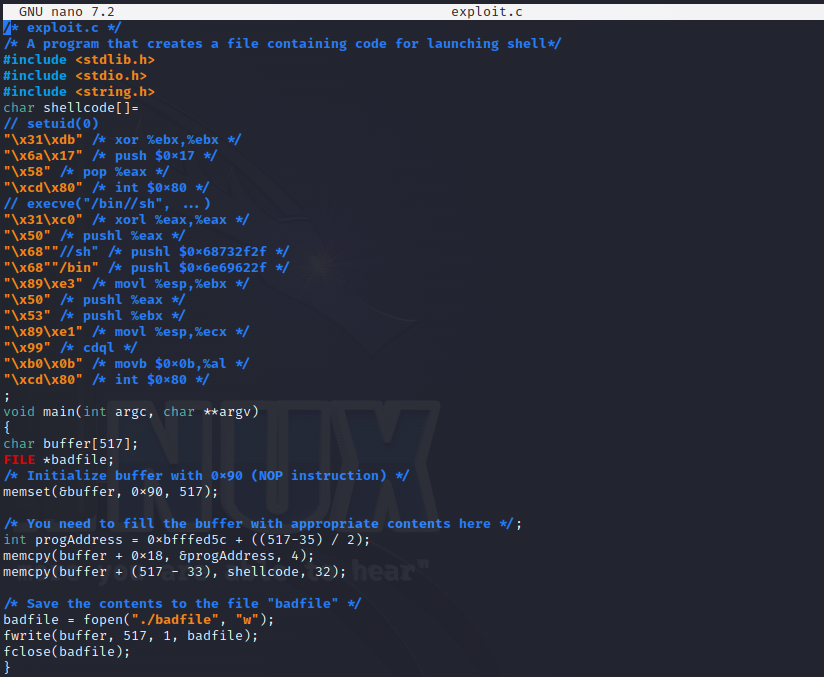
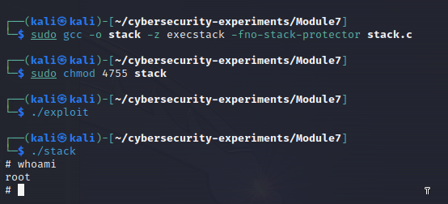
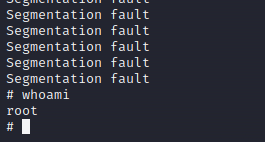
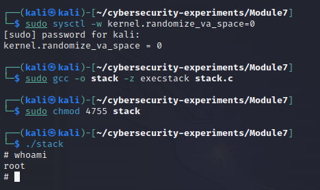
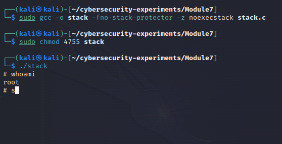

# Lab 7 - Playing with Buffer Overflow

### Team Members:
1. {Name of team member #1}, {email of team member #1}, {PSU ID# of team member #1}
2. {Name of team member #2}, {email of team member #2}, {PSU ID# of team member #2}

## Drills
There are five tasks for you to complete. Please give a brief summary of what you did – feel free to include any thoughts / concerns / problems / etc. you encountered during the tasks. Also, include your answers to the questions asked in each task. Save your report as a PDF and submit it to Canvas before the deadline.

## Task 1

### Task 1: Summary

### Task 1: Question Answers

> 1. Include the screenshots of main steps.
> 2. Include the completed `exploit.c`.

## Task 2

### Task 2: Summary

### Task 2: Question Answers

> 1. Include the screenshots.
> 2. Please describe your observation and explanation.

## Task 3

### Task 3: Summary

### Task 3: Question Answers

> 1. Include the screenshots.
> 2. Please report your observation.

## Task 4

### Task 4: Summary

### Task 4: Question Answers

> 1. Include the screenshots.
>
> Figuring out addresses:
> 
>
> Resulting exploit:
> 
>
> Task 1:
> 
> 
>
> Task2:
> 
> 
>
> Task3:
> 
> 
>
> Task4:
> 
> 
> 
> 2. Please describe your observation and explanation.
>
> We must turn address randomization off before starting.
>
> First we need to find where the return address is stored so we can overwrite with the buffer. We find that it is at 0xbfffed5c (pic 1). The buffer is at 0xbfffed44 (pic 1) which is 0x18 from the return address. So we write at the start byte located 0x18 from buffer.
>
> Next, we determine where we want to jump. Since we don't know what kind of enviroment variables might be declared that would shift the virtual address space, we can't hardcode to the exact location of our shellcode. However, we can guess that the enviromnent variables will take up similar amounts of space between sessions, so we can use a NOP sled to slide into our shell code. As long as we jump to some NOP instruction, we will be able to run our shell code.
>
> So for our badfile, we write our shell code at the end of the 517 byte buffer. This gives us a NOP sled size of 463 bytes. Halfway would be 232 bytes. So we want to try and jump to &buffer + 0x18 + 232. We store this address in the return address. (Which is 0x18 from buffer) This should give us a good chance of landing in the NOP zone given that the enviroment variables take up a similar memory footprint.
>
> We can see in the pictures above (task 1) that this works.
>
> Next we turn address randomization back on. When we do this, the chances of jumping into our NOP sled are much lower. So we run the program in a loop until we land in the NOP zone. You can see this in the above pictures.
>
> For task 3 and 4, I assume they are not supposed to work, but even after deleting my previous executable and restarting, I continue to get a shell.

