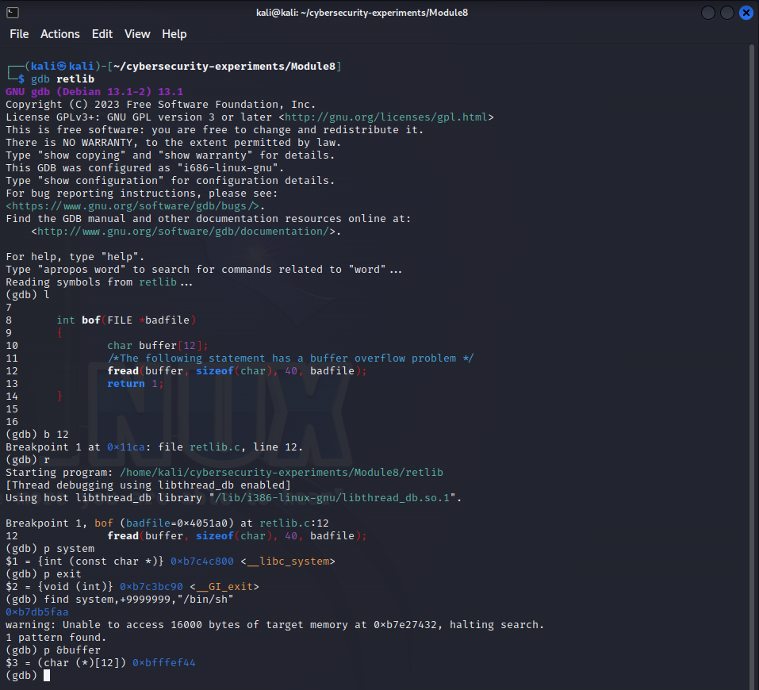
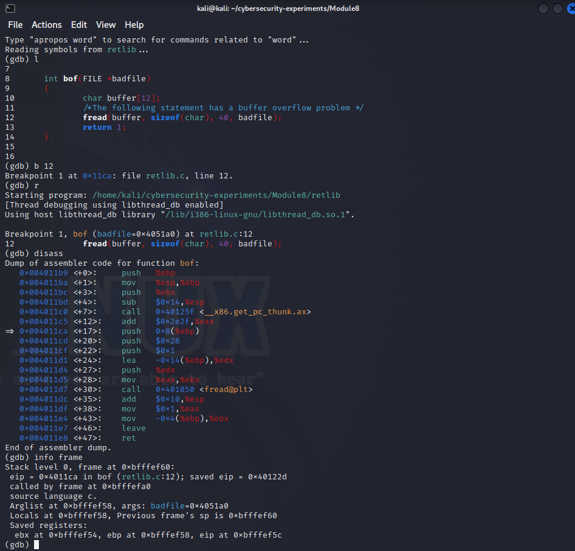
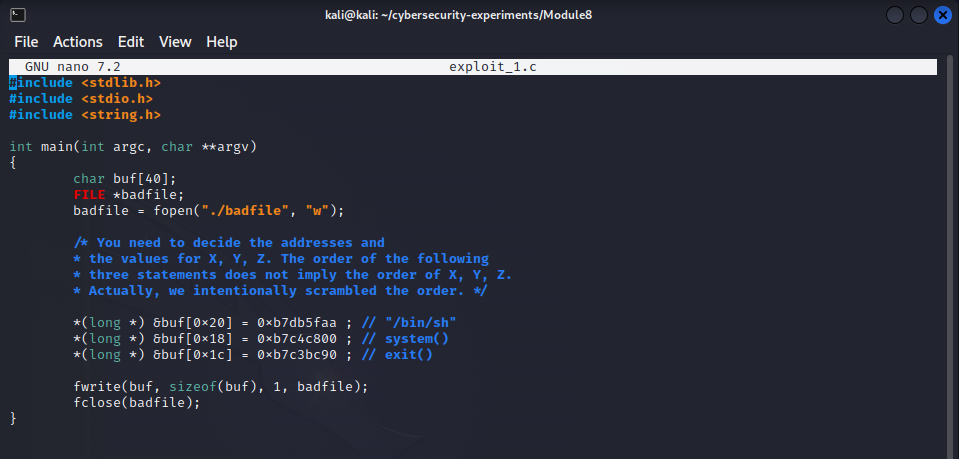

# Lab 8 - Playing with ret2libc

### Team Members:
1. Adam Robertson, abr5598@psu.edu, 938152440

## Drills
There are five tasks for you to complete. Please give a brief summary of what you did – feel free to include any thoughts / concerns / problems / etc. you encountered during the tasks. Also, include your answers to the questions asked in each task. Save your report as a PDF and submit it to Canvas before the deadline.

## Task 

### Task: Summary

### Task: Question Answers

> 1. Include the screenshots of main steps. Make sure the font size in the images is large enough.
>
> 
> 
> 
> 
> 
>
>
>
> 2. Please describe your observation and explanation.
> 
> In the first picture, we can find the addresses for everything we need. In gdb we simply print out the addresses for system, exit, a constant "/bin/sh", and the buffer we are overflowing. 
>
> The system, exit, and /bin/sh addresses need to be copied into the buffer. In order to find where they need to be copied, we have two approches. One, is looking at how the buffer address is being passed into "fread" in the "bof" function. In picture 2, we look at the assembly code leading up to this function call. We see that the buffer is -0x14 from the ebp. We also know that the return address for the "bof" function is +0x4 from the ebp. By taking the difference, we know that the return address is +0x18 from the buffer.
>
> So when writing to the buffer, we should write out call to "system" 0x18 bytes after the buffer. The next higher word will be the return address for our call to system. The word after that will be our argument (/bin/sh).
>
> We could also get this information by taking the difference between the location of eip for the frame and the buffer.
>
> We write the addresses into the correct spot in the buffer in picture 3.

