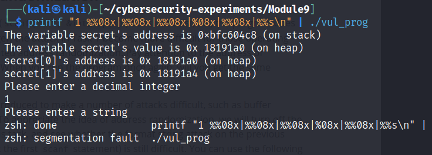
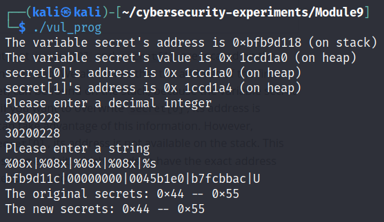
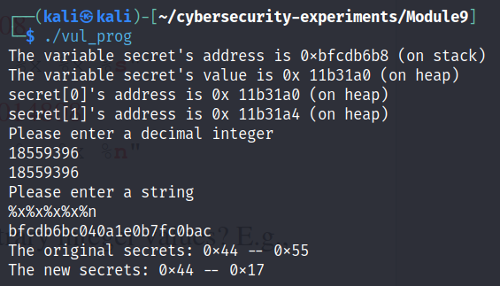
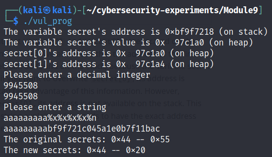

# Lab 9 - Playing with Format String

### Team Members:
1. Adam Robertson, abr5598@psu.edu, 938152440

## Drills
There are five tasks for you to complete. Please give a brief summary of what you did – feel free to include any thoughts / concerns / problems / etc. you encountered during the tasks. Also, include your answers to the questions asked in each task. Save your report as a PDF and submit it to Canvas before the deadline.

## Task 

### Task 1: Summary

In task one, we used a programs unsafe use of printf and unchecked user input to crash the program, access data we shouldn't have access to, and to overwrite data we shouldn't be able to access.

### Task 1: Question Answers

> 1. Include the input your entered.
>
> I piped in for the first part.
> 
> `printf"1 %%08x|%%08x|%%08x|%%08x|%%08x|%%s\n| | ./vul_prog`
>
> Integer: Secret[1] address in decimal
> String: `%08x|%08x|%08x|%08x|%s`
>
> Integer: Secret[1] address in decimal
> String: `%x|%x|%x|%x|%n`
>
> In order to write 0x20:
>Integer: Secret[1] address in decimal
> String: `aaaaaaaaa%x|%x|%x|%x|%n`
> 
> 2. Include the screenshots of major steps. Make sure the font size in the images are large enough.
> 
> 
> 
> 
---

### Task 2: Summary

### Task 2: Question Answers

> 1. Include completed `write_string.c`.
> 2. Include the screenshots of major steps. Make sure the font size in the images is large enough.

